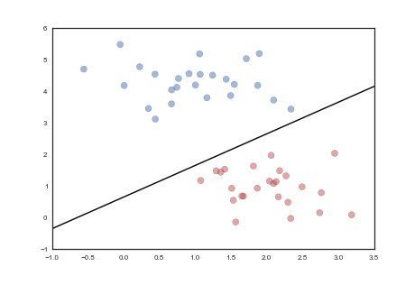

# Logistic Regression 

## Classification

Classification tries to predict which of a set of classes an observation belongs to, where classes are things like "dog or cat". Mathematically, the aim is to find a model $G(X, y)$ where $X$ is a matrix of features constructed from the data, and $y$ is a vector of class labels associated with each row (instance) in $X$, such that the model $G$ does a good job predicting classes given new data $X'$. For instance, consider a doctor trying to assess whether a paitent has heart disease and needs treatment. In this case, the classes are "has heart disease" or "does not have heart disease". To have a machine do this well, we would typically feed the machine a set of data about prior patients along with whether they had heart disease (determined by some other examinations or tests), and *train* the model with the *features* (things observed about the patients, like age, weight, etc.) and the *labels* (whether the patient had heart disease). Then, given the same observations (i.e. the same features) for a *new* patient, the trained model returns the class associated with such observations, which can be used as a predictor of whether the person has heart disease or not.

The main idea on which the Logistic Regression algorithm is based is shown schematically in the image below, for a simple case of two features (a.k.a. 2-D feature space). In its simpler form, the algorithm tries to find a line that divides "things" of two different types in this 2-D feature space. Such a line is usually called a decision boundary, but in general, the decision boundary might have a more complex form, and be in a higher dimensional space (that isn't easily represented in a 2-D chart). Of course, in reality most problems are more complex and are modeled with more than 2 dimensions, as we will see in this Case Study.

